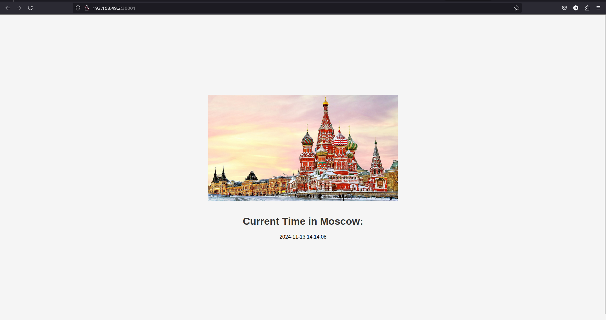

# Kubernetes Deployment Report

This document provides an overview of the current Kubernetes setup for the `moscow-time-app`

## Pods

The output of `kubectl get pods`:

```
$ kubectl get pods
NAME                              READY   STATUS    RESTARTS   AGE
moscow-time-app-98b54bc88-9df27   1/1     Running   0          4m29s
```

## Services

The output of `kubectl get svc`:
```
$ kubectl get svc
NAME                      TYPE        CLUSTER-IP       EXTERNAL-IP   PORT(S)          AGE
kubernetes                ClusterIP   10.96.0.1        <none>        443/TCP          5m19s
moscow-time-app-service   NodePort    10.107.152.216   <none>        5000:30001/TCP   5m6s
```

## Start

### Start minikube

```
minikube start
```

### Apply configs

```
kubectl apply -f k8s/moscow-time-app-deployment.yaml
kubectl apply -f k8s/moscow-time-app-service.yaml
```

### Access via Minikube

```
minikube service moscow-time-app --url
```

## Visit 

`http:<minikube ip>:30001`:



