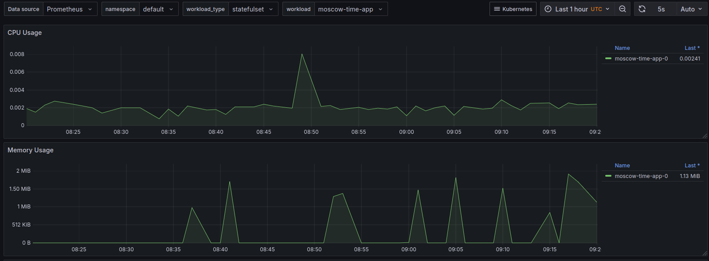
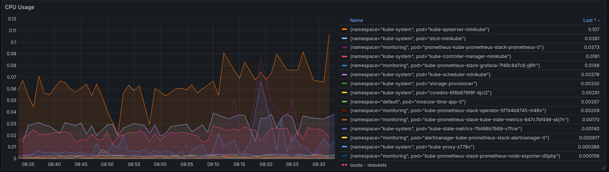

# Kube Prometheus

## Stack components

### Prometheus
Gathers and retains time-series metrics, keeps track of Kubernetes resources, and initiates alerts when specific conditions are met.

### Alertmanager
Manages and directs alerts, facilitating effective alert handling and response.

### Grafana
Offers tools for visualization and dashboard creation, enabling custom views for monitoring and analyzing cluster metrics.

### kube-state-metrics
Reveals metrics about the status of Kubernetes objects, supporting cluster analysis and troubleshooting efforts.

### node-exporter
Gathers metrics from the host machine, covering CPU usage, memory consumption, disk utilization, and network activity.

### Adapter
Allows Prometheus to access metrics from the Kubernetes Metrics APIs, enabling it to collect data on Kubernetes objects like pods, nodes, and containers.

## Outputs explanation

### `kubectl get po --all-namespaces`:
The output shows that all key components of the Kube Prometheus Stack in the monitoring namespace and core Kubernetes services in the kube-system namespace are running as expected, with each pod fully ready and operational. This confirms that both the monitoring stack and Kubernetes infrastructure are successfully deployed and functional.
```
NAMESPACE     NAME                                                        READY   STATUS    RESTARTS        AGE
kube-system   coredns-6f6b679f8f-4p9r5                                    1/1     Running   4 (4m38s ago)   20h
kube-system   etcd-minikube                                               1/1     Running   4 (4m43s ago)   20h
kube-system   kube-apiserver-minikube                                     1/1     Running   4 (4m33s ago)   20h
kube-system   kube-controller-manager-minikube                            1/1     Running   4 (4m43s ago)   20h
kube-system   kube-proxy-skgkc                                            1/1     Running   4 (4m43s ago)   20h
kube-system   kube-scheduler-minikube                                     1/1     Running   4 (4m43s ago)   20h
kube-system   storage-provisioner                                         1/1     Running   4 (4m43s ago)   20h
monitoring    alertmanager-kube-prometheus-stack-alertmanager-0           2/2     Running   0               2m33s
monitoring    kube-prometheus-stack-grafana-7f48c8d7c8-p7nbq              3/3     Running   0               2m53s
monitoring    kube-prometheus-stack-kube-state-metrics-847c7bf499-wfd75   1/1     Running   0               2m53s
monitoring    kube-prometheus-stack-operator-5f7d4b8745-rfglh             1/1     Running   0               2m53s
monitoring    kube-prometheus-stack-prometheus-node-exporter-6lwbh        1/1     Running   0               2m53s
monitoring    prometheus-kube-prometheus-stack-prometheus-0               2/2     Running   0               2m33s
```

### `kubectl get sts --all-namespaces`:
The output shows that the `moscow-time-app` StatefulSet in the `default` namespace and the Kube Prometheus Stack components (`alertmanager` and `prometheus`) in the monitoring namespace are all running with `1/1` readiness, indicating that each StatefulSet has its pod fully initialized and operational. This confirms that both the application and monitoring services are successfully deployed and functioning.
```
NAMESPACE    NAME                                              READY   AGE
default      moscow-time-app                                   1/1     41s
monitoring   alertmanager-kube-prometheus-stack-alertmanager   1/1     8m29s
monitoring   prometheus-kube-prometheus-stack-prometheus       1/1     8m29s
```


### `kubectl get svc --all-namespaces`:
The output lists various Kubernetes services, with `moscow-time-app` services in the `default` namespace exposed through a `NodePort` for external access and a headless service for internal communication. In the `monitoring` and `kube-system` namespaces, it shows internal `ClusterIP` services for the Kube Prometheus Stack components, enabling monitoring, alerting, and metrics collection within the cluster.
```
NAMESPACE     NAME                                             TYPE        CLUSTER-IP       EXTERNAL-IP   PORT(S)                        AGE
default       kubernetes                                       ClusterIP   10.96.0.1        <none>        443/TCP                        20h
default       moscow-time-app-headless                         ClusterIP   None             <none>        80/TCP                         9m52s
default       moscow-time-app-service                          NodePort    10.106.44.79     <none>        5000:30001/TCP                 95m
kube-system   kube-dns                                         ClusterIP   10.96.0.10       <none>        53/UDP,53/TCP,9153/TCP         20h
kube-system   kube-prometheus-stack-coredns                    ClusterIP   None             <none>        9153/TCP                       10m
kube-system   kube-prometheus-stack-kube-controller-manager    ClusterIP   None             <none>        10257/TCP                      10m
kube-system   kube-prometheus-stack-kube-etcd                  ClusterIP   None             <none>        2381/TCP                       10m
kube-system   kube-prometheus-stack-kube-proxy                 ClusterIP   None             <none>        10249/TCP                      10m
kube-system   kube-prometheus-stack-kube-scheduler             ClusterIP   None             <none>        10259/TCP                      10m
kube-system   kube-prometheus-stack-kubelet                    ClusterIP   None             <none>        10250/TCP,10255/TCP,4194/TCP   10m
monitoring    alertmanager-operated                            ClusterIP   None             <none>        9093/TCP,9094/TCP,9094/UDP     10m
monitoring    kube-prometheus-stack-alertmanager               ClusterIP   10.109.204.126   <none>        9093/TCP,8080/TCP              10m
monitoring    kube-prometheus-stack-grafana                    ClusterIP   10.109.2.97      <none>        80/TCP                         10m
monitoring    kube-prometheus-stack-kube-state-metrics         ClusterIP   10.100.119.12    <none>        8080/TCP                       10m
monitoring    kube-prometheus-stack-operator                   ClusterIP   10.99.118.27     <none>        443/TCP                        10m
monitoring    kube-prometheus-stack-prometheus                 ClusterIP   10.109.14.116    <none>        9090/TCP,8080/TCP              10m
monitoring    kube-prometheus-stack-prometheus-node-exporter   ClusterIP   10.103.61.143    <none>        9100/TCP                       10m
monitoring    prometheus-operated                              ClusterIP   None             <none>        9090/TCP                       10m
```

### `kubectl get pvc --all-namespaces`:
This output shows that the `data-moscow-time-app-0` PersistentVolumeClaim in the `default` namespace is successfully bound to a 1Gi storage volume with `ReadWriteOnce` access and the `standard` storage class, and has been active for 64 minutes.
```
NAMESPACE   NAME                     STATUS   VOLUME                                     CAPACITY   ACCESS MODES   STORAGECLASS   VOLUMEATTRIBUTESCLASS   AGE
default     data-moscow-time-app-0   Bound    pvc-a0a4c8d7-66ec-4f1e-bb63-1ebe24f293ba   1Gi        RWO            standard       <unset>                 64m
```

### `kubectl get cm --all-namespaces`:
This output lists ConfigMaps across namespaces, showing system configurations for core Kubernetes functions and Kube Prometheus Stack configurations for monitoring, alerting, and metrics dashboards.
```
NAMESPACE         NAME                                                      DATA   AGE
default           kube-root-ca.crt                                          1      20h
kube-node-lease   kube-root-ca.crt                                          1      20h
kube-public       cluster-info                                              2      20h
kube-public       kube-root-ca.crt                                          1      20h
kube-system       coredns                                                   1      20h
kube-system       extension-apiserver-authentication                        6      20h
kube-system       kube-apiserver-legacy-service-account-token-tracking      1      20h
kube-system       kube-proxy                                                2      20h
kube-system       kube-root-ca.crt                                          1      20h
kube-system       kubeadm-config                                            1      20h
kube-system       kubelet-config                                            1      20h
monitoring        kube-prometheus-stack-alertmanager-overview               1      14m
monitoring        kube-prometheus-stack-apiserver                           1      14m
monitoring        kube-prometheus-stack-cluster-total                       1      14m
monitoring        kube-prometheus-stack-controller-manager                  1      14m
monitoring        kube-prometheus-stack-etcd                                1      14m
monitoring        kube-prometheus-stack-grafana                             1      14m
monitoring        kube-prometheus-stack-grafana-config-dashboards           1      14m
monitoring        kube-prometheus-stack-grafana-datasource                  1      14m
monitoring        kube-prometheus-stack-grafana-overview                    1      14m
monitoring        kube-prometheus-stack-k8s-coredns                         1      14m
monitoring        kube-prometheus-stack-k8s-resources-cluster               1      14m
monitoring        kube-prometheus-stack-k8s-resources-multicluster          1      14m
monitoring        kube-prometheus-stack-k8s-resources-namespace             1      14m
monitoring        kube-prometheus-stack-k8s-resources-node                  1      14m
monitoring        kube-prometheus-stack-k8s-resources-pod                   1      14m
monitoring        kube-prometheus-stack-k8s-resources-workload              1      14m
monitoring        kube-prometheus-stack-k8s-resources-workloads-namespace   1      14m
monitoring        kube-prometheus-stack-kubelet                             1      14m
monitoring        kube-prometheus-stack-namespace-by-pod                    1      14m
monitoring        kube-prometheus-stack-namespace-by-workload               1      14m
monitoring        kube-prometheus-stack-node-cluster-rsrc-use               1      14m
monitoring        kube-prometheus-stack-node-rsrc-use                       1      14m
monitoring        kube-prometheus-stack-nodes                               1      14m
monitoring        kube-prometheus-stack-nodes-aix                           1      14m
monitoring        kube-prometheus-stack-nodes-darwin                        1      14m
monitoring        kube-prometheus-stack-persistentvolumesusage              1      14m
monitoring        kube-prometheus-stack-pod-total                           1      14m
monitoring        kube-prometheus-stack-prometheus                          1      14m
monitoring        kube-prometheus-stack-proxy                               1      14m
monitoring        kube-prometheus-stack-scheduler                           1      14m
monitoring        kube-prometheus-stack-workload-total                      1      14m
monitoring        kube-root-ca.crt                                          1      15m
monitoring        prometheus-kube-prometheus-stack-prometheus-rulefiles-0   35     14m
```

## Utilizing Grafana dashboards
Explore existing dashboards to find information about my cluster:

### a) CPU and Memory consumption
CPU 0.8% at peak, Memory 1.91MiB at peak.



### b) Identifying Pods with higher and lower CPU usage in the `default` namespace.
*There's only one Pod in my `default` namespace - my app. So I changed the query to check all pods from all namespaces.
Highest - `kube-apiserver-minikube` from `kube-system` namespace.
Lowest - `kube-prometheus-stack-prometheus-node-exporter-d5php` from `monitoring` namespace.

