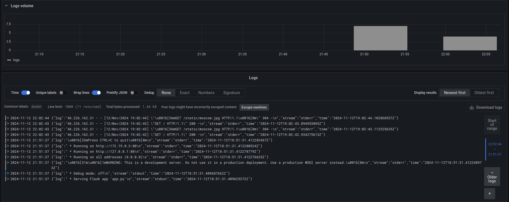
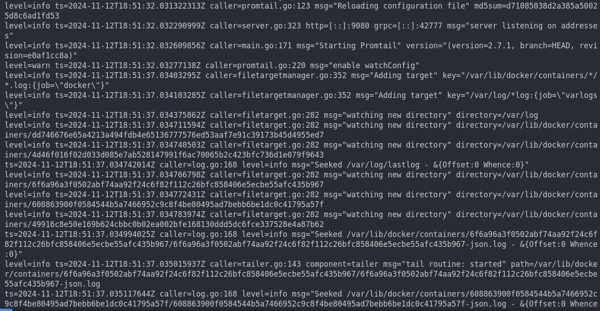
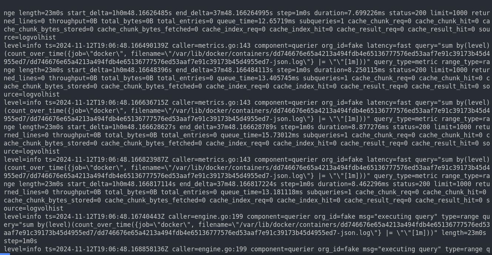
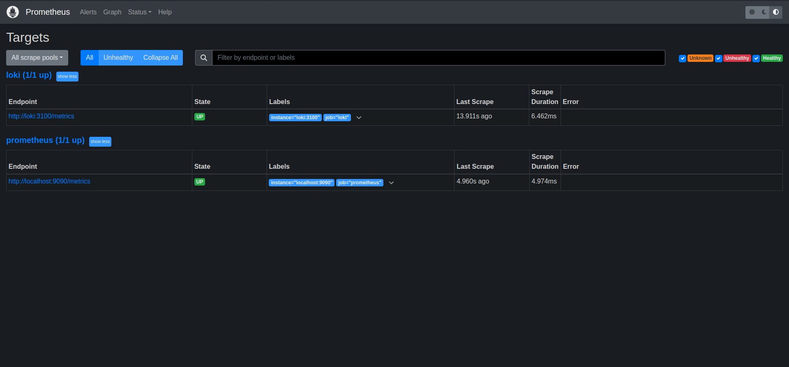

# Logging Stack Report

This report documents the setup and functioning of the logging stack, including Loki, Promtail, and Grafana.

## Configuration Files

### docker-compose.yml
Provides configurations for the services in the stack (Loki, Promtail, Grafana, and `moscow-time-app`). Each service is defined with its image, ports, and volume mappings.

### loki-config.yml
Contains configuration settings for Loki, including storage settings and the API endpoint.

### promtail-config.yml
Configures Promtail to specify where logs are sourced from and which labels to apply. It forwards logs to Loki using Loki's API endpoint.

## Usage Instructions
- Start the stack with `docker-compose up -d` in the `monitoring` directory.
- Access Grafana at `http://<remote_machine_ip>:3000` and log in with the default credentials.
- Add Loki as a data source in Grafana using `http://loki:3100`.
- Use the "Explore" tab in Grafana to query and view logs.

## Troubleshooting Tips
- Ensure that all containers are running using `docker ps -a`.
- Check container logs for any errors (e.g., `sudo docker logs <container_name>`).

## Screenshots

### 1. Grafana Dashboard

### 2. Promtail Logs

### 3. Loki Logs

### 4. Prometheus Logs

